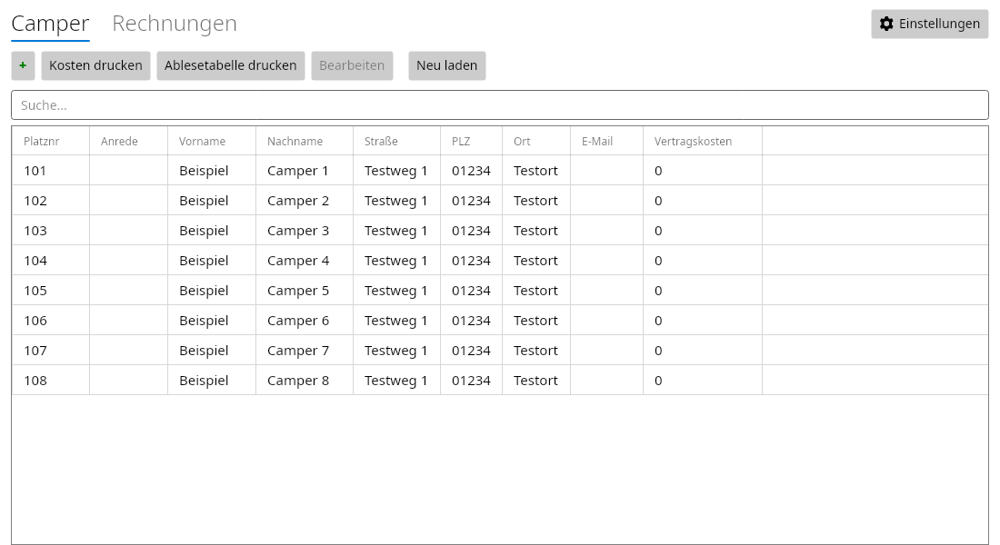

# CamperManagement

CamperManagement verwaltet Camper, Stellplatzbelegungen sowie Wasser- und Stromrechnungen. Die Anwendung nutzt eine gemeinsame Avalonia-Oberfläche und eine zentrale MariaDB-Datenbank. Sie erstellt Rechnungs-PDFs, Kostenübersichten und Ablesetabellen.

## Dokumentation

| Thema | Anleitung |
|---|---|
| Camper, Rechnungen, Preise und PDF-Export | [Bedienungsanleitung](docs/bedienung.md) |
| Installation, Rider, Datenbankverbindung und Fehlerhilfe | [Einrichtung und Betrieb](docs/einrichtung.md) |
| Aufbau des Codes, Geschäftsregeln und Entwicklung | [Entwicklerdokumentation](docs/entwicklung.md) |
| Schemaänderungen, Sicherung und Migrationen | [Datenbankumstellung](docs/database.md) |
| Tests lokal und in Rider ausführen | [Testanleitung](tests/README.md) |
| Abgedeckte Szenarien und Prüfgrenzen | [Testabdeckung](docs/test-coverage.md) |
| GitHub Actions, Signierung und Downloads | [CI/CD und Releases](docs/releases.md) |
| Linux, Android, iOS und Browser | [Plattformprüfungen](docs/platform-checks.md) |

## Funktionsumfang

- Aktuelle Camper anzeigen, suchen und bearbeiten; Belegungswechsel mit Erhalt der Rechnungshistorie.
- Wasser- und Stromrechnungen erfassen, bearbeiten und als PDF exportieren.
- Aktuelle Strom- und Wasserpreise zentral einstellen: **Nach dem Speichern gelten sie sofort für neue Rechnungen, unabhängig vom Abrechnungsjahr.** Bestehende Rechnungen behalten ihre gespeicherten Faktoren.
- Kostenübersichten nach Jahr und Ablesetabellen für aktive Camper erstellen.
- Automatisierte Tests für Berechnung, Datenbank, PDF-Erzeugung und Oberfläche.



Fertige Pakete für Linux x64, Windows x64 und Android stehen nach einem erfolgreichen Versions-Tag unter [GitHub Releases](https://github.com/SlDracon/CamperManagement/releases) bereit.

## Schnellstart für Linux

Benötigt werden das .NET-10-SDK, eine grafische Sitzung und eine erreichbare Datenbank mit dem vorhandenen CamperManagement-Schema einschließlich der Migrationen 001 und 002. Die bisher geprüfte Datenbankversion ist MariaDB 11.8.8. SDK-Auswahl und Paketversionen stehen in [global.json](global.json) und [Directory.Packages.props](Directory.Packages.props).

Alle Befehle in dieser Dokumentation werden im Stammverzeichnis des Repositorys ausgeführt.

1. [Datenbankverbindung konfigurieren](docs/einrichtung.md#datenbankverbindung).
2. Bei einer noch nicht aktualisierten Datenbank die [Migrationsanleitung](docs/database.md) befolgen. Migrationen setzen das vorhandene Basisschema voraus; sie richten keine leere Produktivdatenbank ein.
3. Desktop-Projekt bauen und starten:

```bash
dotnet build CamperManagement.Desktop/CamperManagement.Desktop.csproj -c Debug
dotnet run --project CamperManagement.Desktop/CamperManagement.Desktop.csproj -c Debug --no-build
```

Für Desktop-Arbeit unter Linux gezielt dieses Projekt bauen. Die vollständige Solution enthält zusätzlich mobile und Browser-Projekte mit eigenen Workloads.

## Plattformstatus

| Plattform | Stand |
|---|---|
| Linux Desktop | Debug/Release und `linux-x64`-Publish geprüft; nativer Start mit Testdatenbank geprüft |
| Android | Release-APK und native 16-KB-Ausrichtung geprüft; Android-15-16-KB-Emulator getestet (Details in Plattformprüfungen) |
| iOS | Projekt vorhanden; Build und Lauf benötigen einen Mac mit Xcode und wurden hier nicht geprüft |
| Browser | Projekt lässt sich bauen; für einen funktionsfähigen Webbetrieb ist eine Backend-API erforderlich |

Weitere Einzelheiten und manuelle Prüfschritte stehen in [Plattformprüfungen](docs/platform-checks.md).
