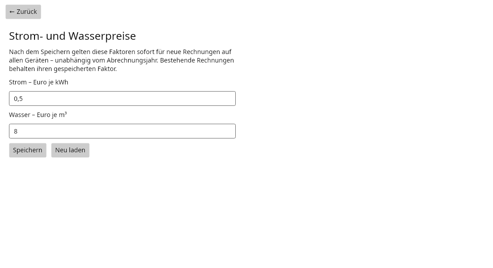

# Bedienungsanleitung

[Zur Dokumentationsübersicht](../README.md)

## Orientierung

Die Startseite enthält die Registerkarten **Camper** und **Rechnungen**. **Einstellungen** öffnet die Strom- und Wasserpreise; in schmalen Fenstern erscheint dafür ein Zahnrad. **Zurück** führt aus einer Unterseite zur vorherigen Ansicht.

Mit **Neu laden** werden Listen beziehungsweise Einstellungen erneut aus der Datenbank gelesen. Noch nicht gespeicherte Änderungen in den Einstellungen werden dabei ersetzt. Formulare speichern erst beim Betätigen von **Speichern**. Während einer Speicherung sind weitere Speicheraktionen gesperrt. Eine Anzeige unterscheidet Laden, Speichern und Export. **Laden abbrechen** beendet die Abfrage; **Erneut laden** wiederholt eine fehlgeschlagene oder abgebrochene Abfrage. Beim Wechsel der Ansicht werden laufende Leseabfragen ebenfalls abgebrochen.

Die Tabellen lassen sich über die Spaltenüberschriften sortieren. Spaltenbreiten können angepasst werden; bei vielen Zeilen oder Spalten stehen Scrollleisten zur Verfügung.

## Camper erfassen und bearbeiten

Unter **Camper** erscheinen die aktiven Belegungen mit ihrer Rechnungsadresse.

1. Mit **+** das Formular öffnen.
2. Eine vorhandene Platznummer auswählen.
3. Vorname, Nachname, Straße, PLZ und Ort eingeben.
4. Bei Bedarf Anrede, E-Mail und Vertragskosten ergänzen.
5. **Speichern** wählen. Anschließend wird die Camperliste aktualisiert.

Anrede und E-Mail sind optional. Leere Vertragskosten werden als **0 Euro** gespeichert. Die Oberfläche bietet keine separate Verwaltung zum Anlegen neuer Platznummern; diese stammen aus der Datenbank.

Eine Camperzeile auswählen und **Bearbeiten**, **Enter** oder **F2** drücken. Alternativ öffnet ein Doppelklick die Bearbeitung. Die Platznummer bleibt dabei fest. **Abbrechen** verwirft die noch nicht gespeicherten Eingaben.

### Belegungswechsel

Zieht eine andere Person auf einen bereits belegten Platz, den neuen Camper über **+** auf diesem Platz anlegen. Beim Speichern wird die bisherige Belegung deaktiviert und die neue Belegung angelegt. Schlägt der Vorgang fehl, bleibt die bisherige Belegung erhalten.

Für einen Personenwechsel nicht einfach den Namen des bisherigen Campers überschreiben. Die Bearbeitung ist für Korrekturen derselben Belegung gedacht. Bereits gespeicherte Rechnungen behalten ihren ursprünglichen Empfänger und die damalige Rechnungsadresse, auch nach einem Wechsel oder einer Stammdatenkorrektur.

## Rechnungen erfassen

1. Unter **Rechnungen** mit **+** ein neues Formular öffnen.
2. **Art** auswählen: Strom oder Wasser.
3. **Platznummer** auswählen und den automatisch geladenen alten Zählerstand prüfen.
4. Den neuen Zählerstand unter **Neu** eingeben.
5. Verbrauch, Faktor und Betrag prüfen; das passende **Jahr** auswählen.
6. **Speichern** wählen.

Neue Rechnungen können dem aktuellen Kalenderjahr oder dem Vorjahr zugeordnet werden. Das Jahr ordnet die Rechnung der Abrechnung zu; es wählt keinen anderen Preis aus.

Nach dem Speichern bleibt die Erfassung geöffnet und wechselt zum nächsten Platz der geladenen Liste. Nach dem letzten Platz beginnt sie wieder am ersten. **Neu** wird zurückgesetzt. So können mehrere Rechnungen nacheinander erfasst werden. Mit **Abbrechen** oder **Zurück** wird die Erfassung verlassen; zuvor erfolgreich gespeicherte Rechnungen bleiben erhalten.

### Zählerstände und Berechnung

- **Alt** stammt aus der zuletzt erfassten Rechnung desselben Platzes und derselben Art. Maßgeblich ist die Erfassung, nicht das Abrechnungsjahr. Ohne vorherige Rechnung wird 0 vorgeschlagen. Das Feld ist im Formular schreibgeschützt.
- **Verbrauch = Neu − Alt**.
- **Betrag = Verbrauch × Faktor**, kaufmännisch auf Cent gerundet. Ein Betrag von 1,005 Euro wird beispielsweise zu 1,01 Euro.
- Bei Summen werden die bereits auf Cent gerundeten Positionen addiert.
- Ein neuer Zählerstand unter dem alten ist erlaubt, etwa bei einem Zählerwechsel. Die Anwendung zeigt eine Warnung; der Verbrauch und gegebenenfalls der Betrag werden dabei negativ.
- Dezimalzahlen können mit Komma oder Punkt eingegeben werden. Tausendertrennzeichen werden nicht unterstützt.

Eine **reine Änderung des Faktors** berechnet den vorhandenen Betrag bewusst nicht automatisch neu. Beim Erfassen zuerst den gewünschten Faktor setzen und anschließend den neuen Zählerstand eingeben. Vor dem Speichern den angezeigten Betrag prüfen. Ein Wechsel zwischen Strom und Wasser lädt den aktuellen Standardfaktor der neuen Art und ersetzt einen zuvor manuell eingegebenen Faktor.

### Vorhandene Rechnung bearbeiten

Eine Rechnung auswählen und **Bearbeiten**, **Enter** oder **F2** drücken. Alternativ öffnet ein Doppelklick die Bearbeitung. Der gespeicherte Faktor und die damaligen Werte werden geladen. Das Öffnen ersetzt den Faktor nicht durch den inzwischen aktuellen Standardpreis.

Art, neuer Zählerstand und Faktor können geändert werden. Platz, Abrechnungsjahr und alter Zählerstand werden über dieses Formular nicht geändert. Beim Speichern schließt sich die Bearbeitung und die Rechnungsliste wird aktualisiert. Eine bewusst geänderte Rechnungsart übernimmt deren aktuellen Standardfaktor.

## Strom- und Wasserpreise einstellen

1. **Einstellungen** öffnen.
2. Strompreis in **Euro je kWh** und Wasserpreis in **Euro je m³** eingeben.
3. **Speichern** wählen und die Erfolgsmeldung abwarten.

Die Werte werden zentral gespeichert und gelten **ab diesem Speichern für neue Rechnungen**, auch wenn diese dem Vorjahr zugeordnet werden. Es gibt keine Jahresauswahl und keinen automatischen Preiswechsel zum Jahreswechsel. Bereits gespeicherte Rechnungen behalten ihre Faktoren und Beträge.

Beispiel: Wird Strom von 0,50 auf 0,60 Euro je kWh geändert, verwenden anschließend neu erfasste Stromrechnungen 0,60 Euro. Eine bereits gespeicherte Rechnung mit 0,50 Euro bleibt unverändert.

Neue Formulare und die fortlaufende Erfassung laden die aktuellen Werte. Ein auf einem anderen Gerät bereits geöffnetes Formular wird nicht laufend per Push aktualisiert; für den neuen Preis eine neue Erfassung öffnen beziehungsweise zum nächsten Platz wechseln. Bei einer Meldung über gleichzeitig geänderte Faktoren zuerst **Neu laden**, die angezeigten Werte prüfen und die gewünschte Änderung erneut speichern.

## Suchen und Auswählen

Die Suche berücksichtigt Groß- und Kleinschreibung nicht. Mehrere durch Leerzeichen getrennte Begriffe müssen alle vorkommen. Anführungszeichen halten eine Wortgruppe zusammen.

| Beispiel | Bedeutung |
|---|---|
| `Beispiel Testort` in der Camperliste | Beide Begriffe kommen in den Stammdaten vor |
| `"Anna und Jan"` | Diese zusammenhängende Wortgruppe kommt in einem Feld vor |
| `2026 Wasser` in der Rechnungsliste | Passende Wasserrechnungen mit dem Jahr 2026 |

Die Camper-Suche berücksichtigt Platznummer und Kontaktdaten. Die Rechnungssuche berücksichtigt unter anderem ID, Platznummer, Jahr, Art, Druckstatus und Zahlenwerte. Ein leeres Suchfeld zeigt wieder alle geladenen Zeilen.

Die Rechnungstabelle unterstützt Mehrfachauswahl, auf dem Desktop etwa mit **Strg + Klick** beziehungsweise **Umschalt + Klick**. Vor einem Rechnungs-PDF-Export die gewünschten Zeilen auswählen. **Neu laden** leert die Rechnungsauswahl.

## PDFs und Auswertungen

Die mit „drucken“ beschrifteten Aktionen erzeugen zunächst PDFs. Für Papierausdrucke wird anschließend der PDF-Viewer verwendet.

| Aktion | Datenumfang | Ergebnis |
|---|---|---|
| Camper → **Kosten drucken** | Rechnungen des anschließend gewählten Jahres | Kostenübersicht; Wasser und Strom bilden die Gesamtsumme, Vertragskosten stehen getrennt |
| Camper → **Ablesetabelle drucken** | Alle aktiven Camper | Ablesetabelle mit den zuletzt erfassten Wasser- und Stromständen |
| Rechnungen → **Tabelle drucken** | Alle aktuell durch die Suche gefilterten Rechnungen | Tabellarische Übersicht; die Zeilenauswahl ist dafür nicht maßgeblich |
| Rechnungen → **Rechnungen drucken** | Ausgewählte Rechnungen | Eine zusammengeführte PDF-Datei |
| Rechnungen → **Rechnungen erstellen** | Ausgewählte Rechnungen | Mehrere PDFs in einem gewählten Ordner, nach Platz und historischem Camper gruppiert |

**Rechnungen erstellen** erzeugt hier PDF-Dateien aus vorhandenen Rechnungen. Neue Datenbank-Rechnungen werden mit **+** erfasst. Bei einem Camperwechsel werden Rechnungen verschiedener Empfänger auch am selben Platz getrennt gehalten.

Die Erfolgsmeldung nach dem Rechnungs-PDF-Export wird nach fünf Sekunden automatisch ausgeblendet.

Der Status **Gedruckt** wird bei den beiden Rechnungs-PDF-Exporten erst gesetzt, wenn **alle ausgewählten Rechnungen erfolgreich gespeichert** wurden. Der Status beschreibt den erfolgreichen PDF-Export, keinen nachgewiesenen Papierausdruck. Tabellen, Kostenübersichten und Ablesetabellen ändern diesen Status nicht.

Beim Abbrechen oder bei einem Teilfehler wird für die Auswahl kein neuer Druckstatus gesetzt; bereits vorher gedruckte Rechnungen behalten ihren Status. Nach einem Teilfehler können im Zielordner schon einzelne Dateien vorhanden sein. Meldet die Anwendung „PDFs gespeichert, aber der Druckstatus konnte nicht gespeichert werden“, die Dateien und die Datenbankverbindung prüfen. Ein fehlgeschlagener Viewer-Start bedeutet nicht, dass die PDF-Datei nicht gespeichert wurde.

**Export abbrechen** beendet die Erstellung beim nächsten Abbruchpunkt. Den Speicherdialog selbst über dessen Abbrechen-Schaltfläche schließen. Bereits angefangene Dateien können unvollständig sein; nach Abbruch bitte erneut exportieren. Sind alle Dateien gespeichert, wird der Abbruch für die abschließende Druckstatus-Speicherung deaktiviert. Während längerer Exporte bleibt die Oberfläche reaktionsfähig. Die exportierten Daten werden zu Beginn festgehalten. Meldet die Anwendung eine fehlende historische Empfängerzuordnung, ist eine administrative Prüfung der betreffenden alten Rechnung nötig; die Empfängerzuordnung kann nicht in diesem Formular repariert werden.

## Häufige Fragen

**Warum bleibt eine alte Rechnung beim bisherigen Camper?** Die Rechnungsanschrift wird beim Erstellen festgehalten. Ein späterer Belegungswechsel darf alte Rechnungen nicht einem anderen Empfänger zuordnen.

**Warum ändert die Preisumstellung keine alten Beträge?** Einstellungen setzen den Standard für neue Rechnungen. Änderungen einer bestehenden Rechnung erfolgen gezielt über deren Bearbeitung.

**Warum ist die Gesamtsumme kleiner als Wasser + Strom + Vertragskosten?** Die Gesamtsumme enthält vereinbarungsgemäß nur Wasser und Strom. Vertragskosten werden separat ausgewiesen.

**Warum ist kein Jahr für die Kostenübersicht auswählbar?** Die Auswahl enthält nur Jahre, für die bereits Rechnungen vorhanden sind.

Bei Verbindungs- und Startproblemen hilft die [Einrichtungs- und Fehlerhilfe](einrichtung.md#fehlerhilfe).
