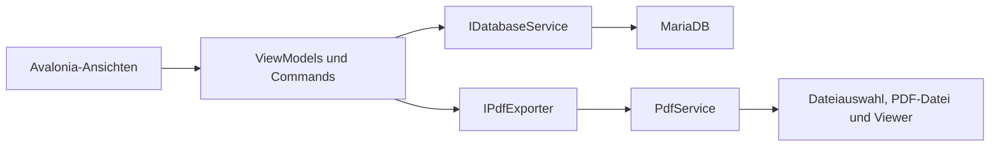

# Entwicklerdokumentation

[Zur Dokumentationsübersicht](../README.md)

## Projektaufbau

| Pfad | Aufgabe |
|---|---|
| [`CamperManagement/`](../CamperManagement/) | Gemeinsame Anwendung: Ansichten, ViewModels, Modelle und Dienste |
| [`CamperManagement.Desktop/`](../CamperManagement.Desktop/) | Desktop-Einstiegspunkt für Avalonia |
| [`CamperManagement.Android/`](../CamperManagement.Android/), [`CamperManagement.iOS/`](../CamperManagement.iOS/), [`CamperManagement.Browser/`](../CamperManagement.Browser/) | Plattformspezifische Einstiegspunkte und Build-Ziele |
| [`CamperManagement/Migrations/`](../CamperManagement/Migrations/) | Versionierte, eingebettete SQL-Migrationen |
| [`tools/CamperManagement.Migrate/`](../tools/CamperManagement.Migrate/) | Explizites CLI-Werkzeug für Prüfung und Migration |
| [`tests/`](../tests/) | Unit-, MariaDB-, PDF- und Avalonia-UI-Tests sowie bisheriger Regressionstest-Runner |
| [`Directory.Packages.props`](../Directory.Packages.props) | Zentrale NuGet-Paketversionen |
| [`global.json`](../global.json) | Auswahl des .NET-SDK |
| [`.github/workflows/tests.yml`](../.github/workflows/tests.yml) | CI für Tests, Linux-Build und Android-Build |

Die gemeinsame Anwendung verwendet .NET 10, Avalonia 11, CommunityToolkit.Mvvm, MySqlConnector und iText. Die genaue Version einer Abhängigkeit gehört in die zentrale Paketdatei. Die eingebetteten Noto-Schriften verwenden die mitgelieferte [SIL Open Font License](../CamperManagement/Assets/Fonts/LICENSE.txt).

## Daten- und Steuerungsfluss



[`MainViewModel`](../CamperManagement/ViewModels/MainViewModel.cs) stellt Datenbankdienst, PDF-Exporter und Uhr bereit und verwaltet den Navigationsstapel. Die Zuordnung der ViewModels zu Ansichten steht in [`App.axaml`](../CamperManagement/App.axaml). Die Ansichten verwenden dieselbe MainViewModel-Instanz; sie erzeugen keine zweite Laufzeitinstanz beim Setzen des DataContext.

Die Dienste entstehen ausschließlich in `AppServices.Create` am App-Start. Datenbank, PDF-Plattformadapter, Uhr, `IDatabaseConfiguration` und `IErrorLog` werden übergeben. `PdfExporter` erhält den aktuellen `TopLevel` als Funktion; Dateihandles bleiben im Adapter und werden gegenüber ViewModels durch `IPdfFile` gekapselt; ViewModels greifen weder auf `Application.Current` noch auf globale Konfiguration zu. Der injizierte `MainViewModel` koordiniert die Navigation. Tests verwenden explizite Verbindungen beziehungsweise Fakes. Die Design-Vorschau enthält nur synthetische Rechnungen und einen Datenbankadapter, der jeden Zugriff verweigert.

| Baustein | Verantwortung |
|---|---|
| [`BillingRules`](../CamperManagement/Services/BillingRules.cs) | Rundung, Jahresgrenze, Zahleninterpretation und Pflichtfelder |
| [`InvoiceFormViewModel`](../CamperManagement/ViewModels/InvoiceFormViewModel.cs) | Gemeinsame Rechnungslogik für Anlegen und Bearbeiten |
| [`CamperFormViewModel`](../CamperManagement/ViewModels/CamperFormViewModel.cs) | Gemeinsame Camper-Eingabe und Speicherung |
| [`SettingsViewModel`](../CamperManagement/ViewModels/SettingsViewModel.cs) | Aktuelle Faktoren laden, validieren und mit Versionsprüfung speichern |
| [`DatabaseService`](../CamperManagement/Services/DatabaseService.cs) | Parametrisierte SQL-Abfragen, Transaktionen und Datenabbildung |
| [`PdfService`](../CamperManagement/Services/PdfService.cs) | PDF-Inhalte, Schriften, Dateihandles und Exportabläufe |
| [`SearchQuery`](../CamperManagement/Services/SearchQuery.cs) | Gemeinsame UND-Suche einschließlich zitierter Wortgruppen |
| [`DataGridSelectedItemsBehavior`](../CamperManagement/Behavior/DataGridSelectedItemsBehavior.cs) | Synchronisierung der Mehrfachauswahl in beide Richtungen |

## Verbindliche Geschäftsregeln

1. Geldpositionen werden mit `MidpointRounding.AwayFromZero` auf zwei Nachkommastellen gerundet. Summen verwenden diese gerundeten Positionen. Wasser und Strom bilden die Gesamtsumme; Vertragskosten sind separat.
2. Änderungen nur am Faktor berechnen einen vorhandenen Betrag bewusst nicht neu. Änderungen der Zählerwerte berechnen Verbrauch und Betrag. Ein expliziter Artwechsel lädt den aktuellen Faktor der gewählten Art.
3. Ein niedrigerer neuer Zählerstand bleibt mit Warnung speicherbar.
4. Der alte Zählerstand stammt aus der zuletzt **erfassten** Rechnung je Platz und Art, sortiert nach `created DESC, id DESC`. Das Ändern einer alten Rechnung macht sie nicht zur zuletzt erfassten Rechnung.
5. Neue Rechnungen sind auf das aktuelle Jahr und das Vorjahr begrenzt. Maßgeblich ist die lokale Zeit des injizierten `TimeProvider`.
6. Standardfaktoren gelten nach erfolgreichem Speichern sofort für neue Rechnungen aller zulässigen Abrechnungsjahre. Bestehende Rechnungen behalten ihre gespeicherten Faktoren; ein Jahreswechsel ändert keine Preise.
7. Ein Belegungswechsel erzeugt neue Stammdaten und bewahrt die historische Empfängerzuordnung alter Rechnungen.
8. Der Druckstatus einer Exportauswahl wird erst nach vollständiger Speicherung aller Rechnungs-PDFs gemeinsam aktualisiert. Ein Tabellenexport ändert ihn nicht.

Die ausführlichen Bedienungsfolgen stehen in der [Bedienungsanleitung](bedienung.md). Der [ursprüngliche Testplan](test-plan.md) ist als historischer Planungsstand gekennzeichnet; seine frühere Jahresbindung der Faktoren ist durch die oben beschriebene Regel ersetzt.

## Persistenz und Migrationen

| Tabelle | Bedeutung |
|---|---|
| `plaetze` | Vorhandene Stellplätze und Platznummern |
| `camper` | Belegungen mit Aktivitäts- und Zeitangaben sowie Vertragskosten |
| `personen`, `camper_personen` | Personen und ihre Verknüpfung zur Belegung, einschließlich Rechnungsadresse |
| `rechnungen` | Rechnungstyp, Jahr, Zählerwerte, gespeicherter Faktor/Betrag und Druckstatus |
| `rechnung_empfaenger` | Dauerhafte Empfänger- und Adresskopie pro Rechnung |
| `standardfaktoren` | Ein aktueller Datensatz für Strom/Wasser mit Versionsnummer |
| `jahresfaktoren` | Altbestand aus Migration 001; von der aktuellen Anwendung nicht mehr verwendet |
| `camper_historie` | Versionierte Vorher-/Nachher-Stände, Bestandsaufnahmen und Belegungswechsel |
| `camper_schema_version` | Ausgeführte Migrationen |

Rechnungszahlen werden als `DECIMAL(18,6)`, Rechnungsbeträge als `DECIMAL(18,2)` gespeichert. Personen-Postleitzahlen sind Text, damit führende Nullen erhalten bleiben.

Camperwechsel sperren den Platz und speichern Deaktivierung, Person, Belegung und Verknüpfung in einer Transaktion. Die expliziten Rollen 1 und 2 in `camper_personen.vertragsnehmer_nr` bestimmen die Vertragsnehmer unabhängig von der Rechnungsadresse; sonstige Kontakte haben keine Rolle. `camper.gemeinsame_adresse` steuert die gemeinsame Anschrift. Beim Rechnungseinfügen werden beide Namen und die gewählte Anschrift in derselben Transaktion festgehalten. Mehrere zusätzliche Kontakte dürfen weder Rechnungszeilen noch Summen vervielfachen.

Faktoren werden als zusammengehöriger Strom-/Wasser-Datensatz gespeichert. Das Update verlangt die zuvor gelesene Versionsnummer; konkurrierende Änderungen werden gemeldet, statt sie unbemerkt zu überschreiben.

Migrationen werden über [`SchemaMigration`](../CamperManagement/Services/SchemaMigration.cs) unter einem Datenbanklock ausgeführt. Einträge in `camper_schema_version` verhindern die erneute normale Ausführung. Neue Migrationen als neue SQL-Datei ergänzen und im Ablauf registrieren; bereits angewendete Migrationen nicht nachträglich umdeuten. Sicherung, bekannte DDL-Grenzen und Aufruf des Tools stehen in [Datenbankumstellung](database.md).

## Asynchrones Verhalten und PDF-Export

`InitializeAsync` und `ResumeAsync` sind abwartbar. Datenbankzugriffe werden nicht versteckt in ViewModel-Konstruktoren gestartet. Leseoperationen geben `CancellationToken` bis an MySqlConnector weiter. Neuladen und Navigation brechen überholte Abfragen ab; vor dem Übernehmen von Ergebnissen wird der Token nochmals geprüft, auch bei nicht kooperierenden Diensten. `IsLoading`, `IsSaving` und `IsExporting` steuern gemeinsame Ladeanzeigen und passende Commands. Fehler oder Abbruch bieten eine erneute Ladeaktion an. Speichervorgänge verwenden die zu Beginn übernommenen Eingabewerte.

Dateidialoge, UI-gebundene Storage-APIs und Statusanzeigen bleiben auf dem UI-Thread. PDF-Erzeugung arbeitet im Hintergrund. Für Exporte werden Listen und ihre Rechnungswerte kopiert, damit spätere Änderungen an Auswahl oder Daten nicht in den laufenden Export geraten.

Ein erfolgreicher PDF-Export und die anschließende Datenbankaktualisierung sind zwei getrennte Schritte. Die Dateisystemoperationen und die Datenbank bilden keine gemeinsame Transaktion. Die Oberfläche meldet deshalb den Sonderfall „Dateien gespeichert, Statusspeicherung fehlgeschlagen“. Ebenso ist ein nicht startender PDF-Viewer kein fehlgeschlagener Dateiexport.

PDF-Abbruch wird zwischen Rechnungen und beim nächsten Schreibzugriff geprüft. Dateidialoge selbst werden im Systemdialog abgebrochen; Avalonia bietet dafür keinen CancellationToken. Nach Abschluss aller Dateien wird der Abbruch vor der atomaren Druckstatus-Transaktion deaktiviert. Speichervorgänge und bereits begonnene Commits besitzen bewusst keinen UI-Abbruch. Angefangene Ausgabedateien können erhalten und unvollständig sein. `IErrorLog` protokolliert technische Fehler ohne Exception-Texte oder Nutzdaten; siehe [Betrieb](einrichtung.md#lokale-fehlerprotokolle). Die bestehenden Tests nutzen gezielt verzögerte Antworten und den echten Avalonia-Dispatcher.

## Entwickeln und prüfen

Die [Testanleitung](../tests/README.md) beschreibt die vier regulären Testprojekte und die Einrichtung der ausschließlich für Tests verwendeten MariaDB. Für Tests ohne Datenbank:

```bash
dotnet test tests/CamperManagement.UnitTests -c Release
dotnet test tests/CamperManagement.PdfTests -c Release
dotnet test tests/CamperManagement.UiTests -c Release
```

Mit eingerichteter Testinstanz und gesetztem `CAMPER_TEST_DB`:

```bash
dotnet test CamperManagement.Tests.sln -c Release --logger trx --collect:'XPlat Code Coverage'
```

Die Integrationstests erzeugen und entfernen eigene Datenbanken `camper_test_<UUID>`. Sie akzeptieren nur die in der Testanleitung genannten lokalen Testhosts. Die Testinstanz muss exklusiv sein, weil auch der globale SQL-Modus geprüft wird. Produktive TrueNAS-Verbindungen oder produktive Sicherungen werden für diese Tests nicht benötigt.

Für einen nativen Starttest gibt es zusätzlich `--smoke-test`. Dazu muss `CAMPER_DB_CONNECTION` ausdrücklich auf eine vorbereitete, migrierte lokale Datenbank mit Präfix `camper_test_` zeigen. Der Aufruf erstellt diese Datenbank nicht selbst:

```bash
dotnet run --project CamperManagement.Desktop -- --smoke-test
```

Er prüft den Start sowie das Laden der beiden Hauptlisten und beendet sich anschließend. Exitcode 0 bedeutet Erfolg, 1 einen Ladefehler und 2 eine abgelehnte Testkonfiguration. Er ersetzt keine Prüfung von System-Dateidialogen, Viewer und realen Geräten.

Die CI reagiert auf Push, Pull Request und manuellen Start. Sie verwendet eine eigene MariaDB, führt die regulären Tests aus, baut Linux und Android und lädt Testergebnisse hoch. Ein konfigurierter Workflow ist noch kein Nachweis eines erfolgreichen CI-Laufs; dessen Ergebnis ist jeweils am betreffenden Commit zu prüfen.

Vor einer Änderung passende Tests auswählen, anschließend den betroffenen Build prüfen. Testberichte, Build-Ausgaben, lokale Konfiguration und Sicherungen bleiben außerhalb von Git. Die Zuordnung zu fachlichen Szenarien und die Grenzen der automatisierten Prüfung stehen in [Testabdeckung](test-coverage.md).

## Gemeinsame Darstellung und Suche

`Styles.axaml` enthält semantische Farben, Formularabstände und Tabellen-/Toolbar-Stile. `OperationStatus` zeigt Laden, Speichern und Export konsistent. Tabellen erlauben Tastaturfokus und Bearbeitung mit Enter/F2; Felder und Symbolschaltflächen besitzen Automation-Namen. Die Suche zerlegt die Anfrage einmal je Eingabe, nicht pro Datensatz. Eine lokale Messung mit 10.000 synthetischen Rechnungen ergab für zehn Filtervorgänge zusammen etwa 50 ms; dies ist ein Messwert dieses Rechners, keine garantierte Laufzeit. Debouncing/Paging bleiben bei künftig größeren Beständen messungsabhängig.

## Camper-Historie

`DatabaseService.History.cs` erfasst vollständige Stammdaten vor und nach jeder fachlichen Änderung innerhalb derselben Platzsperre und Transaktion. Zusätzliche Kontakte werden nicht als Vertragsnehmer interpretiert. Ein Speichern ohne veränderten Zustand erzeugt keinen Historieneintrag. Migration 004 übernimmt den vorhandenen Bestand ausdrücklich als Baseline, ohne vergangene Änderungen zu erfinden.

`CamperHistoryViewModel` lädt asynchron, unterstützt Platzfilter, Suche und Abbruch beim Navigieren. Veraltete Ergebnisse werden verworfen. JSON-Auswertung und Vorbereitung der Suchtexte erfolgen bei Datenbankabfragen außerhalb des UI-Kontexts. Die Ansicht nutzt eine virtualisierte Eintragsliste und einen separat scrollbaren Detailbereich; Änderungen der aktuellen Camperdaten bearbeiten keine Historieneinträge.


## Vertragskostenerhöhungen

`ContractCostIncreaseViewModel` lädt beim Öffnen die aktuellen Camperdaten, zeigt den gerundeten Endpreis als Vorschau und bucht erst über den ausdrücklichen Befehl. `ContractCostRules` prüft positive Centbeträge, die SQL-Dezimalgrenze und die Begründung. `DatabaseService.ContractCosts.cs` verwendet die gleiche Platzsperre wie die übrigen Camper-Schreibvorgänge; Preis und Historie werden atomar gespeichert. Der neue Endpreis bleibt im bestehenden Feld `Vertragskosten`, sodass neue Rechnungskopien und Kostenberichte den gewohnten Datenweg verwenden.

`UpdateCamperAsync` verlangt den ursprünglich gelesenen Preis getrennt vom zu speichernden Modell. Dadurch kann eine bereits geöffnete Stammdatenbearbeitung keine inzwischen gebuchte Erhöhung unbemerkt zurücksetzen. Ein erneuter Buchungsversuch mit veraltetem Preis schlägt ebenfalls fehl. Dies ist eine Prüfung des Ausgangspreises, keine allgemeine Versionskontrolle aller Camperfelder. Nach einem unklaren Netzwerkfehler gibt es keinen automatischen Schreib-Retry; den aktuellen Stand beziehungsweise die Historie neu laden.
